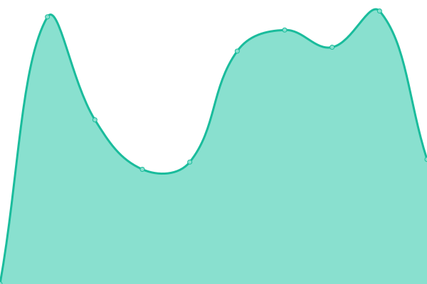

# [📈 Live Status](https://io.unej.id): <!--live status--> **🟧 Partial outage**

This repository contains the open-source uptime monitor and status page for [Techies](oxva.eu.org), powered by [Upptime](https://github.com/upptime/upptime).

With [Upptime](https://upptime.js.org), you can get your own unlimited and free uptime monitor and status page, powered entirely by a GitHub repository. We use [Issues](https://github.com/0rangebananaspy/io/issues) as incident reports, [Actions](https://github.com/0rangebananaspy/io/actions) as uptime monitors, and [Pages](https://io.unej.id) for the status page.

<!--start: status pages-->
<!-- This summary is generated by Upptime (https://github.com/upptime/upptime) -->
<!-- Do not edit this manually, your changes will be overwritten -->
<!-- prettier-ignore -->
| URL | Status | History | Response Time | Uptime |
| --- | ------ | ------- | ------------- | ------ |
|  [SLD](http://io.unej.id) | 🟥 Down | [sld.yml](https://github.com/0rangebananaspy/io/commits/HEAD/history/sld.yml) | 

 1172ms
     
 | 

<a href="https://0rangebananaspy.github.io/io/history/sld">35.80%</a>
    

|  [DNS 1](103.241.205.205) | 🟥 Down | [dns-1.yml](https://github.com/0rangebananaspy/io/commits/HEAD/history/dns-1.yml) | 

 238ms
     
 | 

<a href="https://0rangebananaspy.github.io/io/history/dns-1">52.92%</a>
    

|  [DNS 7](103.241.206.206) | 🟥 Down | [dns-7.yml](https://github.com/0rangebananaspy/io/commits/HEAD/history/dns-7.yml) | 

 236ms
     
 | 

<a href="https://0rangebananaspy.github.io/io/history/dns-7">52.99%</a>
    

|  [SISTER-API](103.241.205.115) | 🟥 Down | [sister-api.yml](https://github.com/0rangebananaspy/io/commits/HEAD/history/sister-api.yml) | 

 0ms
     
 | 

<a href="https://0rangebananaspy.github.io/io/history/sister-api">0.00%</a>
    

|  [SIAKAD](https://siakad.unej.ac.id) | 🟥 Down | [siakad.yml](https://github.com/0rangebananaspy/io/commits/HEAD/history/siakad.yml) | 

 3487ms
     
 | 

<a href="https://0rangebananaspy.github.io/io/history/siakad">53.06%</a>
    

|  [SIBAJA](https://sibaja.unej.ac.id) | 🟥 Down | [sibaja.yml](https://github.com/0rangebananaspy/io/commits/HEAD/history/sibaja.yml) | 

 2989ms
     
 | 

<a href="https://0rangebananaspy.github.io/io/history/sibaja">53.09%</a>
    

|  [SIJAMU](https://sijamu.unej.ac.id) | 🟥 Down | [sijamu.yml](https://github.com/0rangebananaspy/io/commits/HEAD/history/sijamu.yml) | 

 1646ms
     
 | 

<a href="https://0rangebananaspy.github.io/io/history/sijamu">53.12%</a>
    

|  [SIKD](https://sikd.unej.ac.id) | 🟥 Down | [sikd.yml](https://github.com/0rangebananaspy/io/commits/HEAD/history/sikd.yml) | 

 1618ms
     
 | 

<a href="https://0rangebananaspy.github.io/io/history/sikd">53.15%</a>
    

|  [SIMANGGA](https://simangga.unej.ac.id) | 🟥 Down | [simangga.yml](https://github.com/0rangebananaspy/io/commits/HEAD/history/simangga.yml) | 

 2736ms
     
 | 

<a href="https://0rangebananaspy.github.io/io/history/simangga">53.18%</a>
    

|  [SIMKEU](https://simkeu.unej.ac.id) | 🟥 Down | [simkeu.yml](https://github.com/0rangebananaspy/io/commits/HEAD/history/simkeu.yml) | 

 2524ms
     
 | 

<a href="https://0rangebananaspy.github.io/io/history/simkeu">53.21%</a>
    

|  [SIREMUN](https://siremun.unej.ac.id) | 🟥 Down | [siremun.yml](https://github.com/0rangebananaspy/io/commits/HEAD/history/siremun.yml) | 

 2511ms
     
 | 

<a href="https://0rangebananaspy.github.io/io/history/siremun">53.24%</a>
    

|  [MMP](https://mmp.unej.ac.id) | 🟥 Down | [mmp.yml](https://github.com/0rangebananaspy/io/commits/HEAD/history/mmp.yml) | 

 3120ms
     
 | 

<a href="https://0rangebananaspy.github.io/io/history/mmp">43.28%</a>
    

|  [E-SKP](https://eskp.unej.ac.id) | 🟥 Down | [e-skp.yml](https://github.com/0rangebananaspy/io/commits/HEAD/history/e-skp.yml) | 

 0ms
     
 | 

<a href="https://0rangebananaspy.github.io/io/history/e-skp">0.01%</a>
    

|  [E-Dokumen](https://edokumen.unej.ac.id) | 🟥 Down | [e-dokumen.yml](https://github.com/0rangebananaspy/io/commits/HEAD/history/e-dokumen.yml) | 

 1294ms
     
 | 

<a href="https://0rangebananaspy.github.io/io/history/e-dokumen">17.86%</a>
    

|  [E-Surat](https://esurat.unej.ac.id/) | 🟥 Down | [e-surat.yml](https://github.com/0rangebananaspy/io/commits/HEAD/history/e-surat.yml) | 

 2219ms
     
 | 

<a href="https://0rangebananaspy.github.io/io/history/e-surat">53.34%</a>
    

|  [ZOOM UNEJ-server](https://unej-id.zoom.us/) | 🟩 Up | [zoom-unej-server.yml](https://github.com/0rangebananaspy/io/commits/HEAD/history/zoom-unej-server.yml) | 

 144ms
     
 | 

<a href="https://0rangebananaspy.github.io/io/history/zoom-unej-server">100.00%</a>
    

|  [UC3](https://uc3.unej.ac.id) | 🟥 Down | [uc-3.yml](https://github.com/0rangebananaspy/io/commits/HEAD/history/uc-3.yml) | 

 2410ms
     
 | 

<a href="https://0rangebananaspy.github.io/io/history/uc-3">53.37%</a>
    

|  [SSO](https://sso.unej.ac.id) | 🟥 Down | [sso.yml](https://github.com/0rangebananaspy/io/commits/HEAD/history/sso.yml) | 

 1234ms
     
 | 

<a href="https://0rangebananaspy.github.io/io/history/sso">53.40%</a>
    

|  [WEB UNEJ (unej.ac.id)](https://unej.ac.id) | 🟥 Down | [web-unej-unej-ac-id.yml](https://github.com/0rangebananaspy/io/commits/HEAD/history/web-unej-unej-ac-id.yml) | 

 1991ms
     
 | 

<a href="https://0rangebananaspy.github.io/io/history/web-unej-unej-ac-id">53.43%</a>
    

|  [Lumbung](https://lumbung.unej.ac.id) | 🟥 Down | [lumbung.yml](https://github.com/0rangebananaspy/io/commits/HEAD/history/lumbung.yml) | 

 2948ms
     
 | 

<a href="https://0rangebananaspy.github.io/io/history/lumbung">45.79%</a>
    

|  [Kawanda](https://kawanda.unej.ac.id) | 🟥 Down | [kawanda.yml](https://github.com/0rangebananaspy/io/commits/HEAD/history/kawanda.yml) | 

 2077ms
     
 | 

<a href="https://0rangebananaspy.github.io/io/history/kawanda">45.82%</a>
    

|  [Library](https://library.unej.ac.id) | 🟥 Down | [library.yml](https://github.com/0rangebananaspy/io/commits/HEAD/history/library.yml) | 

 1479ms
     
 | 

<a href="https://0rangebananaspy.github.io/io/history/library">45.86%</a>
    

|  [OAILib (Open E-resources Portal)](https://oailib.unej.ac.id/vufind) | 🟥 Down | [oai-lib-open-e-resources-portal.yml](https://github.com/0rangebananaspy/io/commits/HEAD/history/oai-lib-open-e-resources-portal.yml) | 

 2481ms
     
 | 

<a href="https://0rangebananaspy.github.io/io/history/oai-lib-open-e-resources-portal">45.89%</a>
    

|  [Journal](https://journal.unej.ac.id) | 🟥 Down | [journal.yml](https://github.com/0rangebananaspy/io/commits/HEAD/history/journal.yml) | 

 1549ms
     
 | 

<a href="https://0rangebananaspy.github.io/io/history/journal">45.93%</a>
    

|  [Jurnal](https://jurnal.unej.ac.id) | 🟥 Down | [jurnal.yml](https://github.com/0rangebananaspy/io/commits/HEAD/history/jurnal.yml) | 

 1939ms
     
 | 

<a href="https://0rangebananaspy.github.io/io/history/jurnal">45.97%</a>
    

|  [Repository](https://repository.unej.ac.id) | 🟥 Down | [repository.yml](https://github.com/0rangebananaspy/io/commits/HEAD/history/repository.yml) | 

 1934ms
     
 | 

<a href="https://0rangebananaspy.github.io/io/history/repository">46.00%</a>
    

|  [OER (Open Educational Resources)](https://oer.unej.ac.id) | 🟥 Down | [oer-open-educational-resources.yml](https://github.com/0rangebananaspy/io/commits/HEAD/history/oer-open-educational-resources.yml) | 

 1450ms
     
 | 

<a href="https://0rangebananaspy.github.io/io/history/oer-open-educational-resources">46.03%</a>
    

|  [SPI](https://spi.unej.ac.id) | 🟥 Down | [spi.yml](https://github.com/0rangebananaspy/io/commits/HEAD/history/spi.yml) | 

 591ms
     
 | 

<a href="https://0rangebananaspy.github.io/io/history/spi">46.07%</a>
    

|  [LP2M](https://lp2m.unej.ac.id) | 🟥 Down | [lp-2-m.yml](https://github.com/0rangebananaspy/io/commits/HEAD/history/lp-2-m.yml) | 

 0ms
     
 | 

<a href="https://0rangebananaspy.github.io/io/history/lp-2-m">0.03%</a>
    

|  [LP3M](https://lp3m.unej.ac.id) | 🟥 Down | [lp-3-m.yml](https://github.com/0rangebananaspy/io/commits/HEAD/history/lp-3-m.yml) | 

 23967ms
     
 | 

<a href="https://0rangebananaspy.github.io/io/history/lp-3-m">46.12%</a>
    

|  [UPA TIK](https://uptti.unej.ac.id) | 🟥 Down | [upa-tik.yml](https://github.com/0rangebananaspy/io/commits/HEAD/history/upa-tik.yml) | 

 370ms
     
 | 

<a href="https://0rangebananaspy.github.io/io/history/upa-tik">46.14%</a>
    

|  [UPA Bahasa](https://uptbahasa.unej.ac.id) | 🟥 Down | [upa-bahasa.yml](https://github.com/0rangebananaspy/io/commits/HEAD/history/upa-bahasa.yml) | 

 2260ms
     
 | 

<a href="https://0rangebananaspy.github.io/io/history/upa-bahasa">46.18%</a>
    

|  [UPA Perpustakaan](https://perpustakaan.unej.ac.id) | 🟥 Down | [upa-perpustakaan.yml](https://github.com/0rangebananaspy/io/commits/HEAD/history/upa-perpustakaan.yml) | 

 944ms
     
 | 

<a href="https://0rangebananaspy.github.io/io/history/upa-perpustakaan">0.00%</a>
    

|  [UPA Percetakan dan Penerbitan](https://penerbitan.unej.ac.id) | 🟥 Down | [upa-percetakan-dan-penerbitan.yml](https://github.com/0rangebananaspy/io/commits/HEAD/history/upa-percetakan-dan-penerbitan.yml) | 

 457ms
     
 | 

<a href="https://0rangebananaspy.github.io/io/history/upa-percetakan-dan-penerbitan">46.24%</a>
    

|  [UPA PLLT](https://ltsit-cdast.unej.ac.id) | 🟥 Down | [upa-pllt.yml](https://github.com/0rangebananaspy/io/commits/HEAD/history/upa-pllt.yml) | 

 0ms
     
 | 

<a href="https://0rangebananaspy.github.io/io/history/upa-pllt">0.03%</a>
    

|  [UPA Taman Agroteknologi](https://agroteknopark.unej.ac.id) | 🟥 Down | [upa-taman-agroteknologi.yml](https://github.com/0rangebananaspy/io/commits/HEAD/history/upa-taman-agroteknologi.yml) | 

 0ms
     
 | 

<a href="https://0rangebananaspy.github.io/io/history/upa-taman-agroteknologi">0.00%</a>
    

|  [UPA PKK](https://pkk.unej.ac.id) | 🟥 Down | [upa-pkk.yml](https://github.com/0rangebananaspy/io/commits/HEAD/history/upa-pkk.yml) | 

 0ms
     
 | 

<a href="https://0rangebananaspy.github.io/io/history/upa-pkk">0.00%</a>
    

|  [Fakultas Kedokteran](https://fk.unej.ac.id) | 🟥 Down | [fakultas-kedokteran.yml](https://github.com/0rangebananaspy/io/commits/HEAD/history/fakultas-kedokteran.yml) | 

 2771ms
     
 | 

<a href="https://0rangebananaspy.github.io/io/history/fakultas-kedokteran">46.35%</a>
    

|  [Fakultas Hukum](https://law.unej.ac.id) | 🟥 Down | [fakultas-hukum.yml](https://github.com/0rangebananaspy/io/commits/HEAD/history/fakultas-hukum.yml) | 

 0ms
     
 | 

<a href="https://0rangebananaspy.github.io/io/history/fakultas-hukum">0.03%</a>
    

|  [FKG](https://fkg.unej.ac.id) | 🟥 Down | [fkg.yml](https://github.com/0rangebananaspy/io/commits/HEAD/history/fkg.yml) | 

 0ms
     
 | 

<a href="https://0rangebananaspy.github.io/io/history/fkg">0.00%</a>
    

|  [FEB](https://feb.unej.ac.id) | 🟥 Down | [feb.yml](https://github.com/0rangebananaspy/io/commits/HEAD/history/feb.yml) | 

 1260ms
     
 | 

<a href="https://0rangebananaspy.github.io/io/history/feb">46.43%</a>
    

|  [Fakultas Teknik](https://teknik.unej.ac.id) | 🟥 Down | [fakultas-teknik.yml](https://github.com/0rangebananaspy/io/commits/HEAD/history/fakultas-teknik.yml) | 

 0ms
     
 | 

<a href="https://0rangebananaspy.github.io/io/history/fakultas-teknik">0.03%</a>
    

|  [FKIP](https://fkip.unej.ac.id) | 🟥 Down | [fkip.yml](https://github.com/0rangebananaspy/io/commits/HEAD/history/fkip.yml) | 

 0ms
     
 | 

<a href="https://0rangebananaspy.github.io/io/history/fkip">0.03%</a>
    

|  [Fakultas Pertanian](https://faperta.unej.ac.id) | 🟥 Down | [fakultas-pertanian.yml](https://github.com/0rangebananaspy/io/commits/HEAD/history/fakultas-pertanian.yml) | 

 0ms
     
 | 

<a href="https://0rangebananaspy.github.io/io/history/fakultas-pertanian">0.03%</a>
    

|  [FKM](https://fkm.unej.ac.id) | 🟥 Down | [fkm.yml](https://github.com/0rangebananaspy/io/commits/HEAD/history/fkm.yml) | 

 1197ms
     
 | 

<a href="https://0rangebananaspy.github.io/io/history/fkm">26.85%</a>
    

|  [FASILKOM](https://ilkom.unej.ac.id) | 🟥 Down | [fasilkom.yml](https://github.com/0rangebananaspy/io/commits/HEAD/history/fasilkom.yml) | 

 1733ms
     
 | 

<a href="https://0rangebananaspy.github.io/io/history/fasilkom">5.68%</a>
    

|  [FMIPA](https://fmipa.unej.ac.id) | 🟥 Down | [fmipa.yml](https://github.com/0rangebananaspy/io/commits/HEAD/history/fmipa.yml) | 

 0ms
     
 | 

<a href="https://0rangebananaspy.github.io/io/history/fmipa">0.03%</a>
    

|  [Fakultas Farmasi](https://farmasi.unej.ac.id) | 🟥 Down | [fakultas-farmasi.yml](https://github.com/0rangebananaspy/io/commits/HEAD/history/fakultas-farmasi.yml) | 

 2569ms
     
 | 

<a href="https://0rangebananaspy.github.io/io/history/fakultas-farmasi">46.59%</a>
    

|  [FKEP](https://fkep.unej.ac.id) | 🟥 Down | [fkep.yml](https://github.com/0rangebananaspy/io/commits/HEAD/history/fkep.yml) | 

 2012ms
     
 | 

<a href="https://0rangebananaspy.github.io/io/history/fkep">46.62%</a>
    

|  [FIB](https://fib.unej.ac.id) | 🟥 Down | [fib.yml](https://github.com/0rangebananaspy/io/commits/HEAD/history/fib.yml) | 

 0ms
     
 | 

<a href="https://0rangebananaspy.github.io/io/history/fib">0.03%</a>
    

|  [FISIP](https://fisip.unej.ac.id) | 🟥 Down | [fisip.yml](https://github.com/0rangebananaspy/io/commits/HEAD/history/fisip.yml) | 

 2838ms
     
 | 

<a href="https://0rangebananaspy.github.io/io/history/fisip">46.67%</a>
    

|  [FTP](https://www.fateta.unej.ac.id) | 🟥 Down | [ftp.yml](https://github.com/0rangebananaspy/io/commits/HEAD/history/ftp.yml) | 

 555ms
     
 | 

<a href="https://0rangebananaspy.github.io/io/history/ftp">46.71%</a>
    

|  [Pascasarjana](https://pasca.unej.ac.id) | 🟥 Down | [pascasarjana.yml](https://github.com/0rangebananaspy/io/commits/HEAD/history/pascasarjana.yml) | 

 1756ms
     
 | 

<a href="https://0rangebananaspy.github.io/io/history/pascasarjana">46.74%</a>
    

|  [Program Vokasi](https://vokasi.unej.ac.id) | 🟥 Down | [program-vokasi.yml](https://github.com/0rangebananaspy/io/commits/HEAD/history/program-vokasi.yml) | 

 3046ms
     
 | 

<a href="https://0rangebananaspy.github.io/io/history/program-vokasi">46.78%</a>
    

|  [CHRM2](https://chrm2.unej.ac.id) | 🟥 Down | [chrm-2.yml](https://github.com/0rangebananaspy/io/commits/HEAD/history/chrm-2.yml) | 

 644ms
     
 | 

<a href="https://0rangebananaspy.github.io/io/history/chrm-2">46.81%</a>
    

|  [CGS](https://cgs.unej.ac.id) | 🟥 Down | [cgs.yml](https://github.com/0rangebananaspy/io/commits/HEAD/history/cgs.yml) | 

 2286ms
     
 | 

<a href="https://0rangebananaspy.github.io/io/history/cgs">46.85%</a>
    

<!--end: status pages-->

[**Visit our status website →**](https://io.unej.id)

## 📄 License

- Powered by: [Upptime](https://github.com/upptime/upptime)
- Code: [MIT](./LICENSE) © [Techies](oxva.eu.org)
- Data in the `./history` directory: [Open Database License](https://opendatacommons.org/licenses/odbl/1-0/)
