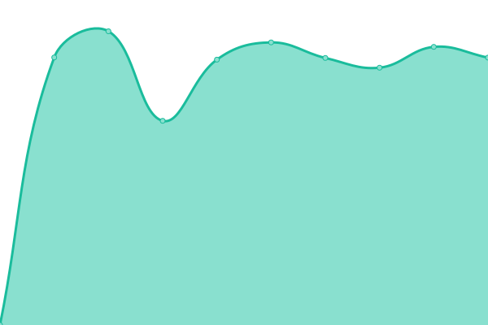

# [📈 Live Status](https://io.unej.id): <!--live status--> **🟧 Partial outage**

This repository contains the open-source uptime monitor and status page for [Techies](oxva.eu.org), powered by [Upptime](https://github.com/upptime/upptime).

With [Upptime](https://upptime.js.org), you can get your own unlimited and free uptime monitor and status page, powered entirely by a GitHub repository. We use [Issues](https://github.com/0rangebananaspy/io/issues) as incident reports, [Actions](https://github.com/0rangebananaspy/io/actions) as uptime monitors, and [Pages](https://io.unej.id) for the status page.

<!--start: status pages-->
<!-- This summary is generated by Upptime (https://github.com/upptime/upptime) -->
<!-- Do not edit this manually, your changes will be overwritten -->
<!-- prettier-ignore -->
| URL | Status | History | Response Time | Uptime |
| --- | ------ | ------- | ------------- | ------ |
|  [DNS 205](103.241.205.205) | 🟩 Up | [dns-205.yml](https://github.com/0rangebananaspy/io/commits/HEAD/history/dns-205.yml) | 

 240ms
     
 | 

<a href="https://io.unej.id/history/dns-205">51.56%</a>
    

|  [DNS 206](103.241.206.206) | 🟩 Up | [dns-206.yml](https://github.com/0rangebananaspy/io/commits/HEAD/history/dns-206.yml) | 

 242ms
     
 | 

<a href="https://io.unej.id/history/dns-206">83.58%</a>
    

|  [SIAKAD](https://siakad.unej.ac.id) | 🟩 Up | [siakad.yml](https://github.com/0rangebananaspy/io/commits/HEAD/history/siakad.yml) | 

 4327ms
     
 | 

<a href="https://io.unej.id/history/siakad">98.23%</a>
    

|  [SIBAJA](https://sibaja.unej.ac.id) | 🟩 Up | [sibaja.yml](https://github.com/0rangebananaspy/io/commits/HEAD/history/sibaja.yml) | 

 5413ms
     
 | 

<a href="https://io.unej.id/history/sibaja">98.44%</a>
    

|  [SIJAMU](https://sijamu.unej.ac.id) | 🟩 Up | [sijamu.yml](https://github.com/0rangebananaspy/io/commits/HEAD/history/sijamu.yml) | 

 2023ms
     
 | 

<a href="https://io.unej.id/history/sijamu">97.38%</a>
    

|  [SIKD](https://sikd.unej.ac.id) | 🟩 Up | [sikd.yml](https://github.com/0rangebananaspy/io/commits/HEAD/history/sikd.yml) | 

 2456ms
     
 | 

<a href="https://io.unej.id/history/sikd">98.93%</a>
    

|  [SIMANGGA](https://simangga.unej.ac.id) | 🟩 Up | [simangga.yml](https://github.com/0rangebananaspy/io/commits/HEAD/history/simangga.yml) | 

 2888ms
     
 | 

<a href="https://io.unej.id/history/simangga">98.23%</a>
    

|  [SIMKEU](https://simkeu.unej.ac.id) | 🟩 Up | [simkeu.yml](https://github.com/0rangebananaspy/io/commits/HEAD/history/simkeu.yml) | 

 3505ms
     
 | 

<a href="https://io.unej.id/history/simkeu">98.95%</a>
    

|  [SIREMUN](https://siremun.unej.ac.id) | 🟩 Up | [siremun.yml](https://github.com/0rangebananaspy/io/commits/HEAD/history/siremun.yml) | 

 2979ms
     
 | 

<a href="https://io.unej.id/history/siremun">98.77%</a>
    

|  [SEMMABA](https://semmaba.unej.ac.id) | 🟩 Up | [semmaba.yml](https://github.com/0rangebananaspy/io/commits/HEAD/history/semmaba.yml) | 

 2199ms
     
 | 

<a href="https://io.unej.id/history/semmaba">99.39%</a>
    

|  [MMP](https://mmp.unej.ac.id) | 🟩 Up | [mmp.yml](https://github.com/0rangebananaspy/io/commits/HEAD/history/mmp.yml) | 

 2270ms
     
 | 

<a href="https://io.unej.id/history/mmp">66.14%</a>
    

|  [E-Dokumen](https://edokumen.unej.ac.id) | 🟩 Up | [e-dokumen.yml](https://github.com/0rangebananaspy/io/commits/HEAD/history/e-dokumen.yml) | 

 1241ms
     
 | 

<a href="https://io.unej.id/history/e-dokumen">66.09%</a>
    

|  [E-Surat](https://esurat.unej.ac.id/) | 🟩 Up | [e-surat.yml](https://github.com/0rangebananaspy/io/commits/HEAD/history/e-surat.yml) | 

 4079ms
     
 | 

<a href="https://io.unej.id/history/e-surat">98.90%</a>
    

|  [ZOOM UNEJ-server](https://unej-id.zoom.us/) | 🟩 Up | [zoom-unej-server.yml](https://github.com/0rangebananaspy/io/commits/HEAD/history/zoom-unej-server.yml) | 

 163ms
     
 | 

<a href="https://io.unej.id/history/zoom-unej-server">100.00%</a>
    

|  [UC3](https://uc3.unej.ac.id) | 🟩 Up | [uc-3.yml](https://github.com/0rangebananaspy/io/commits/HEAD/history/uc-3.yml) | 

 3699ms
     
 | 

<a href="https://io.unej.id/history/uc-3">98.94%</a>
    

|  [SSO](https://sso.unej.ac.id) | 🟩 Up | [sso.yml](https://github.com/0rangebananaspy/io/commits/HEAD/history/sso.yml) | 

 1315ms
     
 | 

<a href="https://io.unej.id/history/sso">98.58%</a>
    

|  [WEB UNEJ (unej.ac.id)](https://unej.ac.id) | 🟩 Up | [web-unej-unej-ac-id.yml](https://github.com/0rangebananaspy/io/commits/HEAD/history/web-unej-unej-ac-id.yml) | 

 2657ms
     
 | 

<a href="https://io.unej.id/history/web-unej-unej-ac-id">99.18%</a>
    

|  [Lumbung](https://lumbung.unej.ac.id) | 🟩 Up | [lumbung.yml](https://github.com/0rangebananaspy/io/commits/HEAD/history/lumbung.yml) | 

 1933ms
     
 | 

<a href="https://io.unej.id/history/lumbung">12.30%</a>
    

|  [Kawanda](https://kawanda.unej.ac.id) | 🟩 Up | [kawanda.yml](https://github.com/0rangebananaspy/io/commits/HEAD/history/kawanda.yml) | 

 2152ms
     
 | 

<a href="https://io.unej.id/history/kawanda">97.56%</a>
    

|  [Library](https://library.unej.ac.id) | 🟩 Up | [library.yml](https://github.com/0rangebananaspy/io/commits/HEAD/history/library.yml) | 

 1840ms
     
 | 

<a href="https://io.unej.id/history/library">98.50%</a>
    

|  [OAILib (Open E-resources Portal)](https://oailib.unej.ac.id/vufind) | 🟩 Up | [oai-lib-open-e-resources-portal.yml](https://github.com/0rangebananaspy/io/commits/HEAD/history/oai-lib-open-e-resources-portal.yml) | 

 2154ms
     
 | 

<a href="https://io.unej.id/history/oai-lib-open-e-resources-portal">52.68%</a>
    

|  [Journal](https://journal.unej.ac.id) | 🟩 Up | [journal.yml](https://github.com/0rangebananaspy/io/commits/HEAD/history/journal.yml) | 

 1413ms
     
 | 

<a href="https://io.unej.id/history/journal">98.99%</a>
    

|  [Jurnal](https://jurnal.unej.ac.id) | 🟩 Up | [jurnal.yml](https://github.com/0rangebananaspy/io/commits/HEAD/history/jurnal.yml) | 

 1860ms
     
 | 

<a href="https://io.unej.id/history/jurnal">65.96%</a>
    

|  [Repository](https://repository.unej.ac.id) | 🟩 Up | [repository.yml](https://github.com/0rangebananaspy/io/commits/HEAD/history/repository.yml) | 

 4574ms
     
 | 

<a href="https://io.unej.id/history/repository">99.28%</a>
    

|  [OER (Open Educational Resources)](https://oer.unej.ac.id) | 🟩 Up | [oer-open-educational-resources.yml](https://github.com/0rangebananaspy/io/commits/HEAD/history/oer-open-educational-resources.yml) | 

 1206ms
     
 | 

<a href="https://io.unej.id/history/oer-open-educational-resources">96.94%</a>
    

|  [Taman Kebangsaan](https://tamankebangsaan.unej.ac.id) | 🟩 Up | [taman-kebangsaan.yml](https://github.com/0rangebananaspy/io/commits/HEAD/history/taman-kebangsaan.yml) | 

 478ms
     
 | 

<a href="https://io.unej.id/history/taman-kebangsaan">99.51%</a>
    

|  [Posko UTBK](https://posko.unej.ac.id) | 🟩 Up | [posko-utbk.yml](https://github.com/0rangebananaspy/io/commits/HEAD/history/posko-utbk.yml) | 

 2550ms
     
 | 

<a href="https://io.unej.id/history/posko-utbk">98.95%</a>
    

|  [Dashboard](https://dashboard.unej.ac.id) | 🟩 Up | [dashboard.yml](https://github.com/0rangebananaspy/io/commits/HEAD/history/dashboard.yml) | 

 3187ms
     
 | 

<a href="https://io.unej.id/history/dashboard">99.65%</a>
    

|  [Klise](https://klise.unej.ac.id) | 🟩 Up | [klise.yml](https://github.com/0rangebananaspy/io/commits/HEAD/history/klise.yml) | 

 1342ms
     
 | 

<a href="https://io.unej.id/history/klise">99.35%</a>
    

|  [Assesor BKD](https://bkd.unej.ac.id) | 🟩 Up | [assesor-bkd.yml](https://github.com/0rangebananaspy/io/commits/HEAD/history/assesor-bkd.yml) | 

 1932ms
     
 | 

<a href="https://io.unej.id/history/assesor-bkd">99.70%</a>
    

|  [Ambara](https://ambara.unej.ac.id) | 🟩 Up | [ambara.yml](https://github.com/0rangebananaspy/io/commits/HEAD/history/ambara.yml) | 

 1952ms
     
 | 

<a href="https://io.unej.id/history/ambara">99.71%</a>
    

|  [PPID](https://ppid.unej.ac.id) | 🟩 Up | [ppid.yml](https://github.com/0rangebananaspy/io/commits/HEAD/history/ppid.yml) | 

 1886ms
     
 | 

<a href="https://io.unej.id/history/ppid">99.11%</a>
    

|  [LMS PPG](https://lmsppg.unej.ac.id) | 🟥 Down | [lms-ppg.yml](https://github.com/0rangebananaspy/io/commits/HEAD/history/lms-ppg.yml) | 

 1234ms
     
 | 

<a href="https://io.unej.id/history/lms-ppg">74.79%</a>
    

|  [Latte](https://latte.unej.ac.id) | 🟩 Up | [latte.yml](https://github.com/0rangebananaspy/io/commits/HEAD/history/latte.yml) | 

 1070ms
     
 | 

<a href="https://io.unej.id/history/latte">98.84%</a>
    

|  [Lavoro](https://lavoro.unej.ac.id) | 🟩 Up | [lavoro.yml](https://github.com/0rangebananaspy/io/commits/HEAD/history/lavoro.yml) | 

 2884ms
     
 | 

<a href="https://io.unej.id/history/lavoro">98.66%</a>
    

|  [VA Bill](https://vabill.unej.ac.id) | 🟩 Up | [va-bill.yml](https://github.com/0rangebananaspy/io/commits/HEAD/history/va-bill.yml) | 

 1398ms
     
 | 

<a href="https://io.unej.id/history/va-bill">94.88%</a>
    

|  [OPTIMA BMN](https://optima-bmn.unej.ac.id) | 🟩 Up | [optima-bmn.yml](https://github.com/0rangebananaspy/io/commits/HEAD/history/optima-bmn.yml) | 

 2308ms
     
 | 

<a href="https://io.unej.id/history/optima-bmn">98.64%</a>
    

|  [SIM RSGM](https://simrsgm.unej.ac.id) | 🟥 Down | [sim-rsgm.yml](https://github.com/0rangebananaspy/io/commits/HEAD/history/sim-rsgm.yml) | 

 3711ms
     
 | 

<a href="https://io.unej.id/history/sim-rsgm">44.87%</a>
    

|  [QR Event](https://qr.unej.ac.id) | 🟩 Up | [qr-event.yml](https://github.com/0rangebananaspy/io/commits/HEAD/history/qr-event.yml) | 

 2523ms
     
 | 

<a href="https://io.unej.id/history/qr-event">98.76%</a>
    

|  [Eproc](https://eproc.unej.ac.id) | 🟩 Up | [eproc.yml](https://github.com/0rangebananaspy/io/commits/HEAD/history/eproc.yml) | 

 2180ms
     
 | 

<a href="https://io.unej.id/history/eproc">65.95%</a>
    

|  [SIMULAN](https://simulan.unej.ac.id) | 🟩 Up | [simulan.yml](https://github.com/0rangebananaspy/io/commits/HEAD/history/simulan.yml) | 

 1814ms
     
 | 

<a href="https://io.unej.id/history/simulan">97.68%</a>
    

|  [Neo Feeder 2023](https://feeder.unej.ac.id) | 🟥 Down | [neo-feeder-2023.yml](https://github.com/0rangebananaspy/io/commits/HEAD/history/neo-feeder-2023.yml) | 

 981ms
     
 | 

<a href="https://io.unej.id/history/neo-feeder-2023">0.00%</a>
    

|  [SRD](https://srd.unej.ac.id) | 🟩 Up | [srd.yml](https://github.com/0rangebananaspy/io/commits/HEAD/history/srd.yml) | 

 2216ms
     
 | 

<a href="https://io.unej.id/history/srd">99.19%</a>
    

|  [Mobile-SIAKAD](https://mobile-siakad.unej.ac.id) | 🟩 Up | [mobile-siakad.yml](https://github.com/0rangebananaspy/io/commits/HEAD/history/mobile-siakad.yml) | 

 2677ms
     
 | 

<a href="https://io.unej.id/history/mobile-siakad">98.22%</a>
    

|  [Mobile-SISTER](https://mobile-sister.unej.ac.id) | 🟩 Up | [mobile-sister.yml](https://github.com/0rangebananaspy/io/commits/HEAD/history/mobile-sister.yml) | 

 1916ms
     
 | 

<a href="https://io.unej.id/history/mobile-sister">98.58%</a>
    

|  [CE & CP Server](https://ce.svr.unej.ac.id) | 🟩 Up | [ce-and-cp-server.yml](https://github.com/0rangebananaspy/io/commits/HEAD/history/ce-and-cp-server.yml) | 

 1057ms
     
 | 

<a href="https://io.unej.id/history/ce-and-cp-server">98.92%</a>
    

|  [PocketBase](https://pb.unej.id/_/#/login) | 🟩 Up | [pocket-base.yml](https://github.com/0rangebananaspy/io/commits/HEAD/history/pocket-base.yml) | 

 1031ms
     
 | 

<a href="https://io.unej.id/history/pocket-base">66.78%</a>
    

|  [AHEC Expo](https://ahecexpo.unej.ac.id/) | 🟥 Down | [ahec-expo.yml](https://github.com/0rangebananaspy/io/commits/HEAD/history/ahec-expo.yml) | 

 0ms
     
 | 

<a href="https://io.unej.id/history/ahec-expo">0.00%</a>
    

|  [Gitea](https://gitea.unej.ac.id/) | 🟩 Up | [gitea.yml](https://github.com/0rangebananaspy/io/commits/HEAD/history/gitea.yml) | 

 1811ms
     
 | 

<a href="https://io.unej.id/history/gitea">99.05%</a>
    

|  [Gitness](https://gitness.unej.ac.id/) | 🟥 Down | [gitness.yml](https://github.com/0rangebananaspy/io/commits/HEAD/history/gitness.yml) | 

 0ms
     
 | 

<a href="https://io.unej.id/history/gitness">0.00%</a>
    

|  [Wiki](https://wiki.tik.unej.ac.id/) | 🟩 Up | [wiki.yml](https://github.com/0rangebananaspy/io/commits/HEAD/history/wiki.yml) | 

 2016ms
     
 | 

<a href="https://io.unej.id/history/wiki">98.92%</a>
    

|  [SIM RSGM](https://simrsgm.unej.ac.id/) | 🟥 Down | [sim-rsgm.yml](https://github.com/0rangebananaspy/io/commits/HEAD/history/sim-rsgm.yml) | 

 3711ms
     
 | 

<a href="https://io.unej.id/history/sim-rsgm">44.87%</a>
    

|  [PRTG](https://prtg.unej.ac.id/) | 🟩 Up | [prtg.yml](https://github.com/0rangebananaspy/io/commits/HEAD/history/prtg.yml) | 

 5542ms
     
 | 

<a href="https://io.unej.id/history/prtg">95.96%</a>
    

|  [SIPALU](103.241.204.234) | 🟩 Up | [sipalu.yml](https://github.com/0rangebananaspy/io/commits/HEAD/history/sipalu.yml) | 

 239ms
     
 | 

<a href="https://io.unej.id/history/sipalu">83.43%</a>
    

<!--end: status pages-->

[**Visit our status website →**](https://io.unej.id)

## 📄 License

- Powered by: [Upptime](https://github.com/upptime/upptime)
- Code: [MIT](./LICENSE) © [Techies](oxva.eu.org)
- Data in the `./history` directory: [Open Database License](https://opendatacommons.org/licenses/odbl/1-0/)
