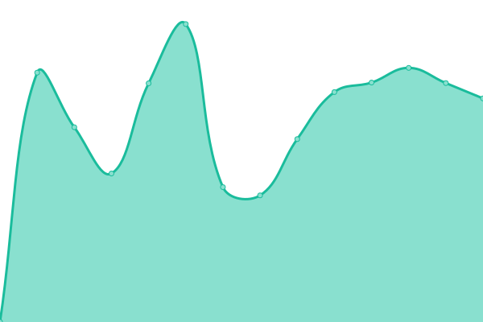
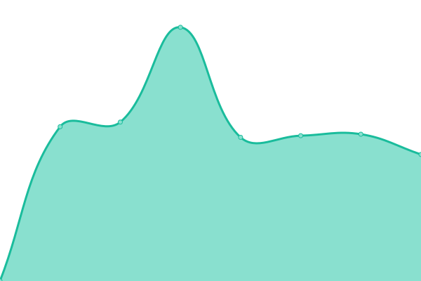

# [📈 Live Status](https://io.unej.id): <!--live status--> **🟧 Partial outage**

This repository contains the open-source uptime monitor and status page for [Techies](oxva.eu.org), powered by [Upptime](https://github.com/upptime/upptime).

With [Upptime](https://upptime.js.org), you can get your own unlimited and free uptime monitor and status page, powered entirely by a GitHub repository. We use [Issues](https://github.com/0rangebananaspy/io/issues) as incident reports, [Actions](https://github.com/0rangebananaspy/io/actions) as uptime monitors, and [Pages](https://io.unej.id) for the status page.

<!--start: status pages-->
<!-- This summary is generated by Upptime (https://github.com/upptime/upptime) -->
<!-- Do not edit this manually, your changes will be overwritten -->
<!-- prettier-ignore -->
| URL | Status | History | Response Time | Uptime |
| --- | ------ | ------- | ------------- | ------ |
|  [DNS 205](103.241.205.205) | 🟩 Up | [dns-205.yml](https://github.com/0rangebananaspy/io/commits/HEAD/history/dns-205.yml) | 

 231ms
     
 | 

<a href="https://io.unej.id/history/dns-205">100.00%</a>
    

|  [DNS 206](103.241.206.206) | 🟩 Up | [dns-206.yml](https://github.com/0rangebananaspy/io/commits/HEAD/history/dns-206.yml) | 

 231ms
     
 | 

<a href="https://io.unej.id/history/dns-206">100.00%</a>
    

|  [SIAKAD](https://siakad.unej.ac.id) | 🟩 Up | [siakad.yml](https://github.com/0rangebananaspy/io/commits/HEAD/history/siakad.yml) | 

 4014ms
     
 | 

<a href="https://io.unej.id/history/siakad">100.00%</a>
    

|  [SIBAJA](https://sibaja.unej.ac.id) | 🟩 Up | [sibaja.yml](https://github.com/0rangebananaspy/io/commits/HEAD/history/sibaja.yml) | 

 3072ms
     
 | 

<a href="https://io.unej.id/history/sibaja">100.00%</a>
    

|  [SIJAMU](https://sijamu.unej.ac.id) | 🟩 Up | [sijamu.yml](https://github.com/0rangebananaspy/io/commits/HEAD/history/sijamu.yml) | 

 1412ms
     
 | 

<a href="https://io.unej.id/history/sijamu">99.52%</a>
    

|  [SIKD](https://sikd.unej.ac.id) | 🟩 Up | [sikd.yml](https://github.com/0rangebananaspy/io/commits/HEAD/history/sikd.yml) | 

 1924ms
     
 | 

<a href="https://io.unej.id/history/sikd">100.00%</a>
    

|  [SIMANGGA](https://simangga.unej.ac.id) | 🟩 Up | [simangga.yml](https://github.com/0rangebananaspy/io/commits/HEAD/history/simangga.yml) | 

 2191ms
     
 | 

<a href="https://io.unej.id/history/simangga">100.00%</a>
    

|  [SIMKEU](https://simkeu.unej.ac.id) | 🟩 Up | [simkeu.yml](https://github.com/0rangebananaspy/io/commits/HEAD/history/simkeu.yml) | 

 2836ms
     
 | 

<a href="https://io.unej.id/history/simkeu">100.00%</a>
    

|  [SIREMUN](https://siremun.unej.ac.id) | 🟩 Up | [siremun.yml](https://github.com/0rangebananaspy/io/commits/HEAD/history/siremun.yml) | 

 2519ms
     
 | 

<a href="https://io.unej.id/history/siremun">100.00%</a>
    

|  [SEMMABA](https://semmaba.unej.ac.id) | 🟩 Up | [semmaba.yml](https://github.com/0rangebananaspy/io/commits/HEAD/history/semmaba.yml) | 

 3067ms
     
 | 

<a href="https://io.unej.id/history/semmaba">100.00%</a>
    

|  [MMP](https://mmp.unej.ac.id) | 🟩 Up | [mmp.yml](https://github.com/0rangebananaspy/io/commits/HEAD/history/mmp.yml) | 

 3438ms
     
 | 

<a href="https://io.unej.id/history/mmp">95.03%</a>
    

|  [E-Dokumen](https://edokumen.unej.ac.id) | 🟩 Up | [e-dokumen.yml](https://github.com/0rangebananaspy/io/commits/HEAD/history/e-dokumen.yml) | 

 1360ms
     
 | 

<a href="https://io.unej.id/history/e-dokumen">100.00%</a>
    

|  [E-Surat](https://esurat.unej.ac.id/) | 🟩 Up | [e-surat.yml](https://github.com/0rangebananaspy/io/commits/HEAD/history/e-surat.yml) | 

 3537ms
     
 | 

<a href="https://io.unej.id/history/e-surat">100.00%</a>
    

|  [ZOOM UNEJ-server](https://unej-id.zoom.us/) | 🟩 Up | [zoom-unej-server.yml](https://github.com/0rangebananaspy/io/commits/HEAD/history/zoom-unej-server.yml) | 

 121ms
     
 | 

<a href="https://io.unej.id/history/zoom-unej-server">100.00%</a>
    

|  [UC3](https://uc3.unej.ac.id) | 🟩 Up | [uc-3.yml](https://github.com/0rangebananaspy/io/commits/HEAD/history/uc-3.yml) | 

 3132ms
     
 | 

<a href="https://io.unej.id/history/uc-3">95.45%</a>
    

|  [SSO](https://sso.unej.ac.id) | 🟩 Up | [sso.yml](https://github.com/0rangebananaspy/io/commits/HEAD/history/sso.yml) | 

 1156ms
     
 | 

<a href="https://io.unej.id/history/sso">100.00%</a>
    

|  [WEB UNEJ (unej.ac.id)](https://unej.ac.id) | 🟩 Up | [web-unej-unej-ac-id.yml](https://github.com/0rangebananaspy/io/commits/HEAD/history/web-unej-unej-ac-id.yml) | 

 3691ms
     
 | 

<a href="https://io.unej.id/history/web-unej-unej-ac-id">100.00%</a>
    

|  [Lumbung](https://lumbung.unej.ac.id) | 🟩 Up | [lumbung.yml](https://github.com/0rangebananaspy/io/commits/HEAD/history/lumbung.yml) | 

 4908ms
     
 | 

<a href="https://io.unej.id/history/lumbung">100.00%</a>
    

|  [Kawanda](https://kawanda.unej.ac.id) | 🟩 Up | [kawanda.yml](https://github.com/0rangebananaspy/io/commits/HEAD/history/kawanda.yml) | 

 2883ms
     
 | 

<a href="https://io.unej.id/history/kawanda">100.00%</a>
    

|  [Library](https://library.unej.ac.id) | 🟩 Up | [library.yml](https://github.com/0rangebananaspy/io/commits/HEAD/history/library.yml) | 

 3301ms
     
 | 

<a href="https://io.unej.id/history/library">100.00%</a>
    

|  [OAILib (Open E-resources Portal)](https://oailib.unej.ac.id/vufind) | 🟩 Up | [oai-lib-open-e-resources-portal.yml](https://github.com/0rangebananaspy/io/commits/HEAD/history/oai-lib-open-e-resources-portal.yml) | 

 2034ms
     
 | 

<a href="https://io.unej.id/history/oai-lib-open-e-resources-portal">99.77%</a>
    

|  [Journal](https://journal.unej.ac.id) | 🟩 Up | [journal.yml](https://github.com/0rangebananaspy/io/commits/HEAD/history/journal.yml) | 

 2154ms
     
 | 

<a href="https://io.unej.id/history/journal">95.03%</a>
    

|  [Jurnal](https://jurnal.unej.ac.id) | 🟩 Up | [jurnal.yml](https://github.com/0rangebananaspy/io/commits/HEAD/history/jurnal.yml) | 

 1806ms
     
 | 

<a href="https://io.unej.id/history/jurnal">99.73%</a>
    

|  [Repository](https://repository.unej.ac.id) | 🟩 Up | [repository.yml](https://github.com/0rangebananaspy/io/commits/HEAD/history/repository.yml) | 

 1602ms
     
 | 

<a href="https://io.unej.id/history/repository">99.80%</a>
    

|  [OER (Open Educational Resources)](https://oer.unej.ac.id) | 🟩 Up | [oer-open-educational-resources.yml](https://github.com/0rangebananaspy/io/commits/HEAD/history/oer-open-educational-resources.yml) | 

 1222ms
     
 | 

<a href="https://io.unej.id/history/oer-open-educational-resources">57.49%</a>
    

|  [Taman Kebangsaan](https://tamankebangsaan.unej.ac.id) | 🟩 Up | [taman-kebangsaan.yml](https://github.com/0rangebananaspy/io/commits/HEAD/history/taman-kebangsaan.yml) | 

 458ms
     
 | 

<a href="https://io.unej.id/history/taman-kebangsaan">100.00%</a>
    

|  [Posko UTBK](https://posko.unej.ac.id) | 🟩 Up | [posko-utbk.yml](https://github.com/0rangebananaspy/io/commits/HEAD/history/posko-utbk.yml) | 

 1381ms
     
 | 

<a href="https://io.unej.id/history/posko-utbk">100.00%</a>
    

|  [Dashboard](https://dashboard.unej.ac.id) | 🟩 Up | [dashboard.yml](https://github.com/0rangebananaspy/io/commits/HEAD/history/dashboard.yml) | 

 1325ms
     
 | 

<a href="https://io.unej.id/history/dashboard">100.00%</a>
    

|  [Klise](https://klise.unej.ac.id) | 🟥 Down | [klise.yml](https://github.com/0rangebananaspy/io/commits/HEAD/history/klise.yml) | 

 1385ms
     
 | 

<a href="https://io.unej.id/history/klise">0.00%</a>
    

|  [Assesor BKD](https://bkd.unej.ac.id) | 🟩 Up | [assesor-bkd.yml](https://github.com/0rangebananaspy/io/commits/HEAD/history/assesor-bkd.yml) | 

 1374ms
     
 | 

<a href="https://io.unej.id/history/assesor-bkd">100.00%</a>
    

|  [Ambara](https://ambara.unej.ac.id) | 🟩 Up | [ambara.yml](https://github.com/0rangebananaspy/io/commits/HEAD/history/ambara.yml) | 

 1364ms
     
 | 

<a href="https://io.unej.id/history/ambara">100.00%</a>
    

|  [PPID](https://ppid.unej.ac.id) | 🟩 Up | [ppid.yml](https://github.com/0rangebananaspy/io/commits/HEAD/history/ppid.yml) | 

 2041ms
     
 | 

<a href="https://io.unej.id/history/ppid">100.00%</a>
    

|  [LMS PPG](https://lmsppg.unej.ac.id) | 🟥 Down | [lms-ppg.yml](https://github.com/0rangebananaspy/io/commits/HEAD/history/lms-ppg.yml) | 

 957ms
     
 | 

<a href="https://io.unej.id/history/lms-ppg">0.00%</a>
    

|  [Latte](https://latte.unej.ac.id) | 🟩 Up | [latte.yml](https://github.com/0rangebananaspy/io/commits/HEAD/history/latte.yml) | 

 1035ms
     
 | 

<a href="https://io.unej.id/history/latte">100.00%</a>
    

|  [Lavoro](https://lavoro.unej.ac.id) | 🟩 Up | [lavoro.yml](https://github.com/0rangebananaspy/io/commits/HEAD/history/lavoro.yml) | 

 4752ms
     
 | 

<a href="https://io.unej.id/history/lavoro">100.00%</a>
    

|  [VA Bill](https://vabill.unej.ac.id) | 🟩 Up | [va-bill.yml](https://github.com/0rangebananaspy/io/commits/HEAD/history/va-bill.yml) | 

 967ms
     
 | 

<a href="https://io.unej.id/history/va-bill">100.00%</a>
    

|  [OPTIMA BMN](https://optima-bmn.unej.ac.id) | 🟩 Up | [optima-bmn.yml](https://github.com/0rangebananaspy/io/commits/HEAD/history/optima-bmn.yml) | 

 1551ms
     
 | 

<a href="https://io.unej.id/history/optima-bmn">100.00%</a>
    

|  [SIM RSGM](https://simrsgm.unej.ac.id) | 🟩 Up | [sim-rsgm.yml](https://github.com/0rangebananaspy/io/commits/HEAD/history/sim-rsgm.yml) | 

 972ms
     
 | 

<a href="https://io.unej.id/history/sim-rsgm">100.00%</a>
    

|  [QR Event](https://qr.unej.ac.id) | 🟩 Up | [qr-event.yml](https://github.com/0rangebananaspy/io/commits/HEAD/history/qr-event.yml) | 

 1107ms
     
 | 

<a href="https://io.unej.id/history/qr-event">100.00%</a>
    

|  [Eproc](https://eproc.unej.ac.id) | 🟩 Up | [eproc.yml](https://github.com/0rangebananaspy/io/commits/HEAD/history/eproc.yml) | 

 2492ms
     
 | 

<a href="https://io.unej.id/history/eproc">100.00%</a>
    

|  [SIMULAN](https://simulan.unej.ac.id) | 🟩 Up | [simulan.yml](https://github.com/0rangebananaspy/io/commits/HEAD/history/simulan.yml) | 

 1006ms
     
 | 

<a href="https://io.unej.id/history/simulan">99.55%</a>
    

|  [Neo Feeder 2023](https://feeder.unej.ac.id/#/login) | 🟥 Down | [neo-feeder-2023.yml](https://github.com/0rangebananaspy/io/commits/HEAD/history/neo-feeder-2023.yml) | 

 956ms
     
 | 

<a href="https://io.unej.id/history/neo-feeder-2023">0.00%</a>
    

|  [SRD](https://srd.unej.ac.id) | 🟥 Down | [srd.yml](https://github.com/0rangebananaspy/io/commits/HEAD/history/srd.yml) | 

 0ms
     
 | 

<a href="https://io.unej.id/history/srd">0.00%</a>
    

|  [Mobile-SIAKAD](https://mobile-siakad.unej.ac.id) | 🟩 Up | [mobile-siakad.yml](https://github.com/0rangebananaspy/io/commits/HEAD/history/mobile-siakad.yml) | 

 4385ms
     
 | 

<a href="https://io.unej.id/history/mobile-siakad">100.00%</a>
    

|  [Mobile-SISTER](https://mobile-sister.unej.ac.id) | 🟩 Up | [mobile-sister.yml](https://github.com/0rangebananaspy/io/commits/HEAD/history/mobile-sister.yml) | 

 2299ms
     
 | 

<a href="https://io.unej.id/history/mobile-sister">100.00%</a>
    

|  [CE & CP Server](https://ce.svr.unej.ac.id) | 🟩 Up | [ce-and-cp-server.yml](https://github.com/0rangebananaspy/io/commits/HEAD/history/ce-and-cp-server.yml) | 

 1088ms
     
 | 

<a href="https://io.unej.id/history/ce-and-cp-server">100.00%</a>
    

|  [PocketBase](https://pb.unej.id/_/#/login) | 🟩 Up | [pocket-base.yml](https://github.com/0rangebananaspy/io/commits/HEAD/history/pocket-base.yml) | 

 994ms
     
 | 

<a href="https://io.unej.id/history/pocket-base">100.00%</a>
    

|  [AHEC Expo](https://ahecexpo.unej.ac.id/) | 🟥 Down | [ahec-expo.yml](https://github.com/0rangebananaspy/io/commits/HEAD/history/ahec-expo.yml) | 

 0ms
     
 | 

<a href="https://io.unej.id/history/ahec-expo">0.00%</a>
    

|  [Gitea](https://gitea.unej.ac.id/) | 🟩 Up | [gitea.yml](https://github.com/0rangebananaspy/io/commits/HEAD/history/gitea.yml) | 

 1194ms
     
 | 

<a href="https://io.unej.id/history/gitea">100.00%</a>
    

|  [Gitness](https://gitness.unej.ac.id/) | 🟥 Down | [gitness.yml](https://github.com/0rangebananaspy/io/commits/HEAD/history/gitness.yml) | 

 0ms
     
 | 

<a href="https://io.unej.id/history/gitness">0.00%</a>
    

|  [Wiki](https://wiki.tik.unej.ac.id/) | 🟩 Up | [wiki.yml](https://github.com/0rangebananaspy/io/commits/HEAD/history/wiki.yml) | 

 1418ms
     
 | 

<a href="https://io.unej.id/history/wiki">100.00%</a>
    

|  [Wiki UNEJ](https://wiki.unej.ac.id/) | 🟥 Down | [wiki-unej.yml](https://github.com/0rangebananaspy/io/commits/HEAD/history/wiki-unej.yml) | 

 1472ms
     
 | 

<a href="https://io.unej.id/history/wiki-unej">91.34%</a>
    

|  [SIM RSGM](https://simrsgm.unej.ac.id/) | 🟩 Up | [sim-rsgm.yml](https://github.com/0rangebananaspy/io/commits/HEAD/history/sim-rsgm.yml) | 

 972ms
     
 | 

<a href="https://io.unej.id/history/sim-rsgm">100.00%</a>
    

|  [PRTG](https://prtg.unej.ac.id/) | 🟩 Up | [prtg.yml](https://github.com/0rangebananaspy/io/commits/HEAD/history/prtg.yml) | 

 2459ms
     
 | 

<a href="https://io.unej.id/history/prtg">100.00%</a>
    

|  [SIPALU](103.241.204.234) | 🟩 Up | [sipalu.yml](https://github.com/0rangebananaspy/io/commits/HEAD/history/sipalu.yml) | 

 234ms
     
 | 

<a href="https://io.unej.id/history/sipalu">99.71%</a>
    

|  [Survei Kepuasan](https://survei.unej.ac.id/) | 🟩 Up | [survei-kepuasan.yml](https://github.com/0rangebananaspy/io/commits/HEAD/history/survei-kepuasan.yml) | 

 1376ms
     
 | 

<a href="https://io.unej.id/history/survei-kepuasan">100.00%</a>
    

|  [Insentif Publikasi](https://insentif.unej.ac.id/) | 🟩 Up | [insentif-publikasi.yml](https://github.com/0rangebananaspy/io/commits/HEAD/history/insentif-publikasi.yml) | 

 3147ms
     
 | 

<a href="https://io.unej.id/history/insentif-publikasi">99.69%</a>
    

|  [E-Training LPMPP](https://e-traininglp3m.unej.ac.id/) | 🟩 Up | [e-training-lpmpp.yml](https://github.com/0rangebananaspy/io/commits/HEAD/history/e-training-lpmpp.yml) | 

 2546ms
     
 | 

<a href="https://io.unej.id/history/e-training-lpmpp">100.00%</a>
    

|  [QR Event](https://qr.unej.ac.id/login) | 🟩 Up | [qr-event.yml](https://github.com/0rangebananaspy/io/commits/HEAD/history/qr-event.yml) | 

 1107ms
     
 | 

<a href="https://io.unej.id/history/qr-event">100.00%</a>
    

<!--end: status pages-->

[**Visit our status website →**](https://io.unej.id)

## 📄 License

- Powered by: [Upptime](https://github.com/upptime/upptime)
- Code: [MIT](./LICENSE) © [Techies](oxva.eu.org)
- Data in the `./history` directory: [Open Database License](https://opendatacommons.org/licenses/odbl/1-0/)
