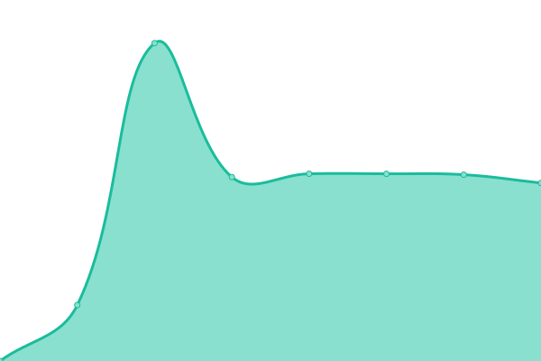

# [📈 Live Status](https://io.unej.id): <!--live status--> **🟧 Partial outage**

This repository contains the open-source uptime monitor and status page for [Techies](oxva.eu.org), powered by [Upptime](https://github.com/upptime/upptime).

With [Upptime](https://upptime.js.org), you can get your own unlimited and free uptime monitor and status page, powered entirely by a GitHub repository. We use [Issues](https://github.com/0rangebananaspy/io/issues) as incident reports, [Actions](https://github.com/0rangebananaspy/io/actions) as uptime monitors, and [Pages](https://io.unej.id) for the status page.

<!--start: status pages-->
<!-- This summary is generated by Upptime (https://github.com/upptime/upptime) -->
<!-- Do not edit this manually, your changes will be overwritten -->
<!-- prettier-ignore -->
| URL | Status | History | Response Time | Uptime |
| --- | ------ | ------- | ------------- | ------ |
|  [DNS 205](103.241.205.205) | 🟩 Up | [dns-205.yml](https://github.com/0rangebananaspy/io/commits/HEAD/history/dns-205.yml) | 

 237ms
     
 | 

<a href="https://io.unej.id/history/dns-205">99.03%</a>
    

|  [DNS 206](103.241.206.206) | 🟩 Up | [dns-206.yml](https://github.com/0rangebananaspy/io/commits/HEAD/history/dns-206.yml) | 

 236ms
     
 | 

<a href="https://io.unej.id/history/dns-206">99.04%</a>
    

|  [SIAKAD](https://siakad.unej.ac.id) | 🟥 Down | [siakad.yml](https://github.com/0rangebananaspy/io/commits/HEAD/history/siakad.yml) | 

 4746ms
     
 | 

<a href="https://io.unej.id/history/siakad">93.13%</a>
    

|  [SIBAJA](https://sibaja.unej.ac.id) | 🟥 Down | [sibaja.yml](https://github.com/0rangebananaspy/io/commits/HEAD/history/sibaja.yml) | 

 3390ms
     
 | 

<a href="https://io.unej.id/history/sibaja">93.84%</a>
    

|  [SIJAMU](https://sijamu.unej.ac.id) | 🟩 Up | [sijamu.yml](https://github.com/0rangebananaspy/io/commits/HEAD/history/sijamu.yml) | 

 1853ms
     
 | 

<a href="https://io.unej.id/history/sijamu">95.25%</a>
    

|  [SIKD](https://sikd.unej.ac.id) | 🟩 Up | [sikd.yml](https://github.com/0rangebananaspy/io/commits/HEAD/history/sikd.yml) | 

 3773ms
     
 | 

<a href="https://io.unej.id/history/sikd">94.97%</a>
    

|  [SIMANGGA](https://simangga.unej.ac.id) | 🟥 Down | [simangga.yml](https://github.com/0rangebananaspy/io/commits/HEAD/history/simangga.yml) | 

 2141ms
     
 | 

<a href="https://io.unej.id/history/simangga">95.80%</a>
    

|  [SIMKEU](https://simkeu.unej.ac.id) | 🟩 Up | [simkeu.yml](https://github.com/0rangebananaspy/io/commits/HEAD/history/simkeu.yml) | 

 3639ms
     
 | 

<a href="https://io.unej.id/history/simkeu">96.02%</a>
    

|  [SIREMUN](https://siremun.unej.ac.id) | 🟩 Up | [siremun.yml](https://github.com/0rangebananaspy/io/commits/HEAD/history/siremun.yml) | 

 3062ms
     
 | 

<a href="https://io.unej.id/history/siremun">95.42%</a>
    

|  [SEMMABA](https://semmaba.unej.ac.id) | 🟥 Down | [semmaba.yml](https://github.com/0rangebananaspy/io/commits/HEAD/history/semmaba.yml) | 

 2830ms
     
 | 

<a href="https://io.unej.id/history/semmaba">82.46%</a>
    

|  [MMP](https://mmp.unej.ac.id) | 🟥 Down | [mmp.yml](https://github.com/0rangebananaspy/io/commits/HEAD/history/mmp.yml) | 

 2682ms
     
 | 

<a href="https://io.unej.id/history/mmp">83.51%</a>
    

|  [E-Dokumen](https://edokumen.unej.ac.id) | 🟩 Up | [e-dokumen.yml](https://github.com/0rangebananaspy/io/commits/HEAD/history/e-dokumen.yml) | 

 1916ms
     
 | 

<a href="https://io.unej.id/history/e-dokumen">97.05%</a>
    

|  [E-Surat](https://esurat.unej.ac.id/) | 🟥 Down | [e-surat.yml](https://github.com/0rangebananaspy/io/commits/HEAD/history/e-surat.yml) | 

 3292ms
     
 | 

<a href="https://io.unej.id/history/e-surat">94.76%</a>
    

|  [ZOOM UNEJ-server](https://unej-id.zoom.us/) | 🟩 Up | [zoom-unej-server.yml](https://github.com/0rangebananaspy/io/commits/HEAD/history/zoom-unej-server.yml) | 

 117ms
     
 | 

<a href="https://io.unej.id/history/zoom-unej-server">100.00%</a>
    

|  [UC3](https://uc3.unej.ac.id) | 🟥 Down | [uc-3.yml](https://github.com/0rangebananaspy/io/commits/HEAD/history/uc-3.yml) | 

 3222ms
     
 | 

<a href="https://io.unej.id/history/uc-3">95.80%</a>
    

|  [SSO](https://sso.unej.ac.id) | 🟥 Down | [sso.yml](https://github.com/0rangebananaspy/io/commits/HEAD/history/sso.yml) | 

 1275ms
     
 | 

<a href="https://io.unej.id/history/sso">95.23%</a>
    

|  [WEB UNEJ (unej.ac.id)](https://unej.ac.id) | 🟥 Down | [web-unej-unej-ac-id.yml](https://github.com/0rangebananaspy/io/commits/HEAD/history/web-unej-unej-ac-id.yml) | 

 2844ms
     
 | 

<a href="https://io.unej.id/history/web-unej-unej-ac-id">96.95%</a>
    

|  [Lumbung](https://lumbung.unej.ac.id) | 🟩 Up | [lumbung.yml](https://github.com/0rangebananaspy/io/commits/HEAD/history/lumbung.yml) | 

 4875ms
     
 | 

<a href="https://io.unej.id/history/lumbung">68.12%</a>
    

|  [Kawanda](https://kawanda.unej.ac.id) | 🟩 Up | [kawanda.yml](https://github.com/0rangebananaspy/io/commits/HEAD/history/kawanda.yml) | 

 4475ms
     
 | 

<a href="https://io.unej.id/history/kawanda">92.54%</a>
    

|  [Library](https://library.unej.ac.id) | 🟩 Up | [library.yml](https://github.com/0rangebananaspy/io/commits/HEAD/history/library.yml) | 

 3570ms
     
 | 

<a href="https://io.unej.id/history/library">96.07%</a>
    

|  [OAILib (Open E-resources Portal)](https://oailib.unej.ac.id/vufind) | 🟩 Up | [oai-lib-open-e-resources-portal.yml](https://github.com/0rangebananaspy/io/commits/HEAD/history/oai-lib-open-e-resources-portal.yml) | 

 2276ms
     
 | 

<a href="https://io.unej.id/history/oai-lib-open-e-resources-portal">16.85%</a>
    

|  [Journal](https://journal.unej.ac.id) | 🟩 Up | [journal.yml](https://github.com/0rangebananaspy/io/commits/HEAD/history/journal.yml) | 

 1821ms
     
 | 

<a href="https://io.unej.id/history/journal">88.45%</a>
    

|  [Jurnal](https://jurnal.unej.ac.id) | 🟩 Up | [jurnal.yml](https://github.com/0rangebananaspy/io/commits/HEAD/history/jurnal.yml) | 

 2286ms
     
 | 

<a href="https://io.unej.id/history/jurnal">86.02%</a>
    

|  [Repository](https://repository.unej.ac.id) | 🟩 Up | [repository.yml](https://github.com/0rangebananaspy/io/commits/HEAD/history/repository.yml) | 

 4119ms
     
 | 

<a href="https://io.unej.id/history/repository">92.54%</a>
    

|  [OER (Open Educational Resources)](https://oer.unej.ac.id) | 🟩 Up | [oer-open-educational-resources.yml](https://github.com/0rangebananaspy/io/commits/HEAD/history/oer-open-educational-resources.yml) | 

 2720ms
     
 | 

<a href="https://io.unej.id/history/oer-open-educational-resources">17.94%</a>
    

|  [Taman Kebangsaan](https://tamankebangsaan.unej.ac.id) | 🟩 Up | [taman-kebangsaan.yml](https://github.com/0rangebananaspy/io/commits/HEAD/history/taman-kebangsaan.yml) | 

 1095ms
     
 | 

<a href="https://io.unej.id/history/taman-kebangsaan">99.13%</a>
    

|  [Posko UTBK](https://posko.unej.ac.id) | 🟩 Up | [posko-utbk.yml](https://github.com/0rangebananaspy/io/commits/HEAD/history/posko-utbk.yml) | 

 1929ms
     
 | 

<a href="https://io.unej.id/history/posko-utbk">97.44%</a>
    

|  [Dashboard](https://dashboard.unej.ac.id) | 🟩 Up | [dashboard.yml](https://github.com/0rangebananaspy/io/commits/HEAD/history/dashboard.yml) | 

 5589ms
     
 | 

<a href="https://io.unej.id/history/dashboard">96.54%</a>
    

|  [Klise](https://klise.unej.ac.id) | 🟥 Down | [klise.yml](https://github.com/0rangebananaspy/io/commits/HEAD/history/klise.yml) | 

 1377ms
     
 | 

<a href="https://io.unej.id/history/klise">0.00%</a>
    

|  [Assesor BKD](https://bkd.unej.ac.id) | 🟩 Up | [assesor-bkd.yml](https://github.com/0rangebananaspy/io/commits/HEAD/history/assesor-bkd.yml) | 

 1633ms
     
 | 

<a href="https://io.unej.id/history/assesor-bkd">97.61%</a>
    

|  [Ambara](https://ambara.unej.ac.id) | 🟩 Up | [ambara.yml](https://github.com/0rangebananaspy/io/commits/HEAD/history/ambara.yml) | 

 3183ms
     
 | 

<a href="https://io.unej.id/history/ambara">95.96%</a>
    

|  [PPID](https://ppid.unej.ac.id) | 🟩 Up | [ppid.yml](https://github.com/0rangebananaspy/io/commits/HEAD/history/ppid.yml) | 

 4872ms
     
 | 

<a href="https://io.unej.id/history/ppid">96.13%</a>
    

|  [LMS PPG](https://lmsppg.unej.ac.id) | 🟥 Down | [lms-ppg.yml](https://github.com/0rangebananaspy/io/commits/HEAD/history/lms-ppg.yml) | 

 977ms
     
 | 

<a href="https://io.unej.id/history/lms-ppg">0.00%</a>
    

|  [Latte](https://latte.unej.ac.id) | 🟩 Up | [latte.yml](https://github.com/0rangebananaspy/io/commits/HEAD/history/latte.yml) | 

 1114ms
     
 | 

<a href="https://io.unej.id/history/latte">97.89%</a>
    

|  [Lavoro](https://lavoro.unej.ac.id) | 🟩 Up | [lavoro.yml](https://github.com/0rangebananaspy/io/commits/HEAD/history/lavoro.yml) | 

 4170ms
     
 | 

<a href="https://io.unej.id/history/lavoro">88.57%</a>
    

|  [VA Bill](https://vabill.unej.ac.id) | 🟩 Up | [va-bill.yml](https://github.com/0rangebananaspy/io/commits/HEAD/history/va-bill.yml) | 

 1936ms
     
 | 

<a href="https://io.unej.id/history/va-bill">98.17%</a>
    

|  [OPTIMA BMN](https://optima-bmn.unej.ac.id) | 🟩 Up | [optima-bmn.yml](https://github.com/0rangebananaspy/io/commits/HEAD/history/optima-bmn.yml) | 

 1604ms
     
 | 

<a href="https://io.unej.id/history/optima-bmn">97.35%</a>
    

|  [SIM RSGM](https://simrsgm.unej.ac.id) | 🟩 Up | [sim-rsgm.yml](https://github.com/0rangebananaspy/io/commits/HEAD/history/sim-rsgm.yml) | 

 1171ms
     
 | 

<a href="https://io.unej.id/history/sim-rsgm">96.20%</a>
    

|  [QR Event](https://qr.unej.ac.id) | 🟩 Up | [qr-event.yml](https://github.com/0rangebananaspy/io/commits/HEAD/history/qr-event.yml) | 

 3943ms
     
 | 

<a href="https://io.unej.id/history/qr-event">97.36%</a>
    

|  [Eproc](https://eproc.unej.ac.id) | 🟩 Up | [eproc.yml](https://github.com/0rangebananaspy/io/commits/HEAD/history/eproc.yml) | 

 3584ms
     
 | 

<a href="https://io.unej.id/history/eproc">94.73%</a>
    

|  [SIMULAN](https://simulan.unej.ac.id) | 🟩 Up | [simulan.yml](https://github.com/0rangebananaspy/io/commits/HEAD/history/simulan.yml) | 

 1504ms
     
 | 

<a href="https://io.unej.id/history/simulan">98.27%</a>
    

|  [Neo Feeder 2023](https://feeder.unej.ac.id/#/login) | 🟥 Down | [neo-feeder-2023.yml](https://github.com/0rangebananaspy/io/commits/HEAD/history/neo-feeder-2023.yml) | 

 985ms
     
 | 

<a href="https://io.unej.id/history/neo-feeder-2023">54.16%</a>
    

|  [SRD](https://srd.unej.ac.id) | 🟥 Down | [srd.yml](https://github.com/0rangebananaspy/io/commits/HEAD/history/srd.yml) | 

 2772ms
     
 | 

<a href="https://io.unej.id/history/srd">14.97%</a>
    

|  [Mobile-SIAKAD](https://mobile-siakad.unej.ac.id) | 🟩 Up | [mobile-siakad.yml](https://github.com/0rangebananaspy/io/commits/HEAD/history/mobile-siakad.yml) | 

 4964ms
     
 | 

<a href="https://io.unej.id/history/mobile-siakad">93.31%</a>
    

|  [Mobile-SISTER](https://mobile-sister.unej.ac.id) | 🟥 Down | [mobile-sister.yml](https://github.com/0rangebananaspy/io/commits/HEAD/history/mobile-sister.yml) | 

 3040ms
     
 | 

<a href="https://io.unej.id/history/mobile-sister">94.69%</a>
    

|  [CE & CP Server](https://ce.svr.unej.ac.id) | 🟩 Up | [ce-and-cp-server.yml](https://github.com/0rangebananaspy/io/commits/HEAD/history/ce-and-cp-server.yml) | 

 2090ms
     
 | 

<a href="https://io.unej.id/history/ce-and-cp-server">98.28%</a>
    

|  [PocketBase](https://pb.unej.id/_/#/login) | 🟩 Up | [pocket-base.yml](https://github.com/0rangebananaspy/io/commits/HEAD/history/pocket-base.yml) | 

 3145ms
     
 | 

<a href="https://io.unej.id/history/pocket-base">97.52%</a>
    

|  [AHEC Expo](https://ahecexpo.unej.ac.id/) | 🟥 Down | [ahec-expo.yml](https://github.com/0rangebananaspy/io/commits/HEAD/history/ahec-expo.yml) | 

 0ms
     
 | 

<a href="https://io.unej.id/history/ahec-expo">0.00%</a>
    

|  [Gitea](https://gitea.unej.ac.id/) | 🟥 Down | [gitea.yml](https://github.com/0rangebananaspy/io/commits/HEAD/history/gitea.yml) | 

 1255ms
     
 | 

<a href="https://io.unej.id/history/gitea">97.04%</a>
    

|  [Gitness](https://gitness.unej.ac.id/) | 🟥 Down | [gitness.yml](https://github.com/0rangebananaspy/io/commits/HEAD/history/gitness.yml) | 

 0ms
     
 | 

<a href="https://io.unej.id/history/gitness">0.00%</a>
    

|  [Wiki](https://wiki.tik.unej.ac.id/) | 🟩 Up | [wiki.yml](https://github.com/0rangebananaspy/io/commits/HEAD/history/wiki.yml) | 

 4279ms
     
 | 

<a href="https://io.unej.id/history/wiki">97.96%</a>
    

|  [Wiki UNEJ](https://wiki.unej.ac.id/) | 🟩 Up | [wiki-unej.yml](https://github.com/0rangebananaspy/io/commits/HEAD/history/wiki-unej.yml) | 

 3476ms
     
 | 

<a href="https://io.unej.id/history/wiki-unej">97.07%</a>
    

|  [SIM RSGM](https://simrsgm.unej.ac.id/) | 🟩 Up | [sim-rsgm.yml](https://github.com/0rangebananaspy/io/commits/HEAD/history/sim-rsgm.yml) | 

 1171ms
     
 | 

<a href="https://io.unej.id/history/sim-rsgm">96.20%</a>
    

|  [PRTG](https://prtg.unej.ac.id/) | 🟩 Up | [prtg.yml](https://github.com/0rangebananaspy/io/commits/HEAD/history/prtg.yml) | 

 2465ms
     
 | 

<a href="https://io.unej.id/history/prtg">96.33%</a>
    

|  [SIPALU](103.241.204.234) | 🟩 Up | [sipalu.yml](https://github.com/0rangebananaspy/io/commits/HEAD/history/sipalu.yml) | 

 233ms
     
 | 

<a href="https://io.unej.id/history/sipalu">98.18%</a>
    

|  [Survei Kepuasan](https://survei.unej.ac.id/) | 🟩 Up | [survei-kepuasan.yml](https://github.com/0rangebananaspy/io/commits/HEAD/history/survei-kepuasan.yml) | 

 4330ms
     
 | 

<a href="https://io.unej.id/history/survei-kepuasan">96.40%</a>
    

|  [Insentif Publikasi](https://insentif.unej.ac.id/) | 🟥 Down | [insentif-publikasi.yml](https://github.com/0rangebananaspy/io/commits/HEAD/history/insentif-publikasi.yml) | 

 3038ms
     
 | 

<a href="https://io.unej.id/history/insentif-publikasi">75.63%</a>
    

|  [E-Training LPMPP](https://e-traininglp3m.unej.ac.id/) | 🟩 Up | [e-training-lpmpp.yml](https://github.com/0rangebananaspy/io/commits/HEAD/history/e-training-lpmpp.yml) | 

 3147ms
     
 | 

<a href="https://io.unej.id/history/e-training-lpmpp">90.95%</a>
    

|  [QR Event](https://qr.unej.ac.id/login) | 🟩 Up | [qr-event.yml](https://github.com/0rangebananaspy/io/commits/HEAD/history/qr-event.yml) | 

 3943ms
     
 | 

<a href="https://io.unej.id/history/qr-event">97.36%</a>
    

<!--end: status pages-->

[**Visit our status website →**](https://io.unej.id)

## 📄 License

- Powered by: [Upptime](https://github.com/upptime/upptime)
- Code: [MIT](./LICENSE) © [Techies](oxva.eu.org)
- Data in the `./history` directory: [Open Database License](https://opendatacommons.org/licenses/odbl/1-0/)
